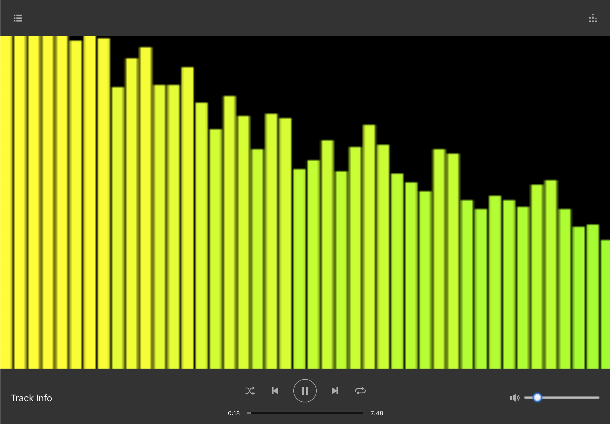

# (The Extremely Creatively Named) Music Video Player

This is a browser-based (possibly standalone in the future) audio player with a focus on creative audio-triggered visualizations. The UI is less than halfway thought through, using Spotify's player controls as a rough reference.

## Current Features

- [X] Loads a local audio file and plays / pauses with working volume / muting controls
- [X] Has a very basic and messy bar graph visualization

## Future Features

- [ ] Have a better name
- [ ] Connect to a Spotify account's playlists
- [ ] Have a local file browser
- [ ] Have many unique visualizations with options
- [ ] Fullscreen mode
- [ ] Be a standalone native app

## Far Future Features

- [ ] Camera gesture interactions?

| Screenshot |
| --- |
|  |

## Inspiration

Visuals that are reactive to sound fascinate me. I have both a design and music heavy background. Each has influenced the other. This seems like an interesting way to explore both of these things together.

I've also come to the realization that not everyone can enjoy music by itself. Anyone who is hearing impaired should still be able to experience music in some way. This project is a way for me to explore these possibilities.

Some things that inspired this project:
- [Atari Video Music](https://en.wikipedia.org/wiki/Atari_Video_Music)
- [Adult Swim Singles](https://www.adultswim.com/music/singles-2017/61)
- [Tarik Barri](http://tarikbarri.nl/video)

## Available Scripts

In the project directory, you can run:

### `npm start`

Runs the app in the development mode. 
Open [http://localhost:3000](http://localhost:3000) to view it in the browser.

The page will reload if you make edits. 
You will also see any lint errors in the console.

### `npm test`

Launches the test runner in the interactive watch mode. 
See the section about [running tests](https://facebook.github.io/create-react-app/docs/running-tests) for more information.

### `npm run build`

Builds the app for production to the `build` folder. 
It correctly bundles React in production mode and optimizes the build for the best performance.

The build is minified and the filenames include the hashes. 
Your app is ready to be deployed!

See the section about [deployment](https://facebook.github.io/create-react-app/docs/deployment) for more information.
